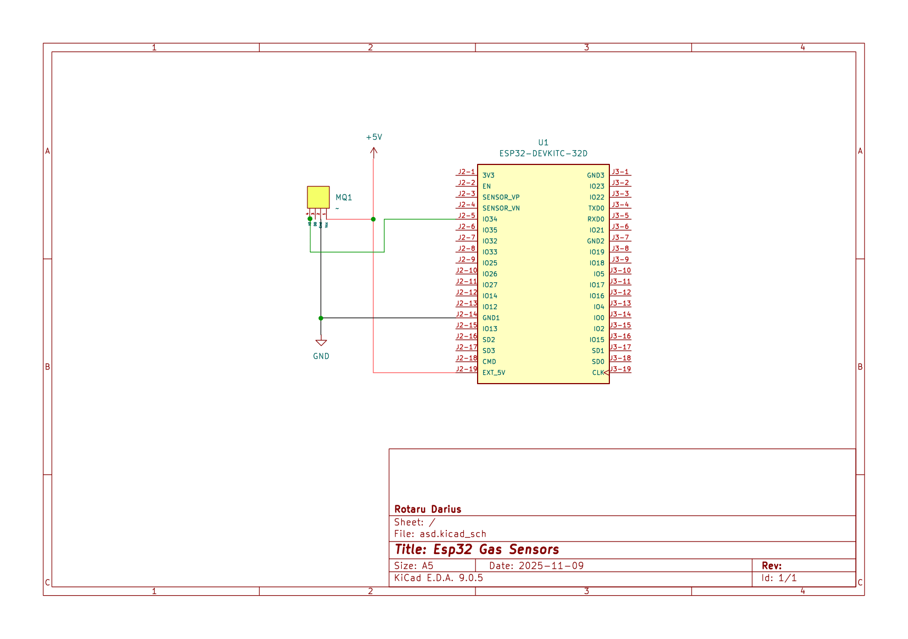

# ESP32 BARE METAL GAS SENSOR

Bare-metal C application that reads the analog value from an MQ2 gas sensor, and connects to the WiFi, and HA's MQTT broker and transmits the data that is read.

The architeture is non-blocking using FreeRTOS tasks and event groups to manage async operations, which ensures a stable, responsive application.

## Components Used:
* **µcontroller:** ESP32
* **Sensor:** MQ-2 Gas Sensor Module (with only the analog out connected)
* **Software:** PlatformIO (IDE), Home Assistant (for the broker).

### Schematic | Wiring | Showcase

## Key Features:
* **Bare-Metal C (ESP-IDF):** 
* **Modular Architecture:** 
* **Multi-Tasking with FreeRTOS:** 
* **Event-Driven Design:** 
* **Non-Blocking:** 

## Code Structure

* **`main.c`**: Minimal knowledge file, calls the initializing functions from the various header files.
* **`wifi.c`**: Self contained Wifi file that handles all WiFi connections and event handling.
* **`mqtt.c`**: Self contained MQTT file that handles all MQTT connections and event handling.
* **`sensor.c`**: Self contained sensor file, that is used to initialized the adc and transfer the data payload.
